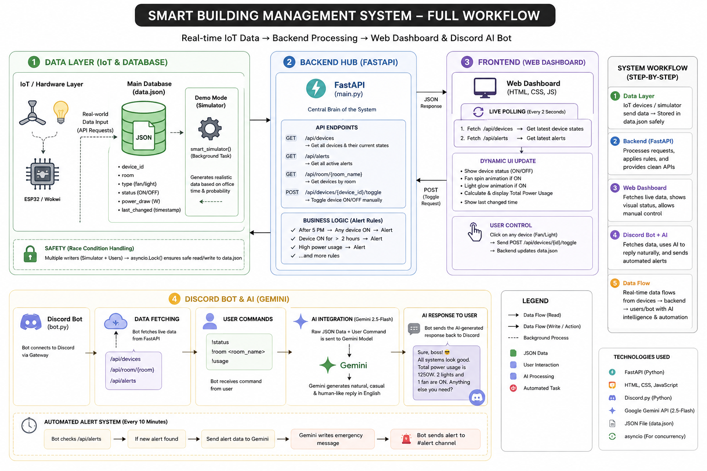

# Smart Building Management System

A simple real-time system for monitoring and controlling office lights and fans.

This project helps users see which devices are ON or OFF, check current power usage, control devices from a web dashboard, and receive smart alerts through a Discord AI bot.

---

## Demo Video

Add your demo video link here:

[Watch Demo Video](YOUR_DEMO_VIDEO_LINK_HERE)

---

## Full System Workflow



This image shows the complete process of the system, from IoT-ready data collection to dashboard monitoring and Discord AI response.

---

## What This Project Does

This project works like a smart office monitoring system.

It can:

- Monitor lights and fans in different rooms
- Show live ON/OFF status
- Show current total power usage
- Show room-wise power usage
- Allow users to turn devices ON or OFF from the dashboard
- Detect unnecessary electricity usage
- Send alerts when devices are left ON after office hours or running for a long time
- Reply to users through a Discord AI bot

---

## Main Idea

In many offices, lights and fans are often left ON after office hours. This wastes electricity and increases cost.

This system helps solve that problem by continuously checking device status and showing everything in one place.

Users can quickly understand:

- Which room is using power
- Which device is ON
- Which device should be turned OFF
- Whether any alert has been generated
- How much power is currently being used

---

## How the System Works

The system follows five main steps.

### Step 1: Data Collection

Device data can come from IoT hardware or a demo simulator.

In a real system, this data can come from devices like ESP32 or Wokwi simulation.

For the demo version, a simulator creates realistic device activity based on office hours.

---

### Step 2: Data Storage

All device information is stored in a simple JSON data file.

The stored information includes:

- Device name
- Room name
- Device type
- Current status
- Power usage
- Last changed time

This works like the main memory of the system.

---

### Step 3: Backend Processing

The backend works as the brain of the system.

It receives requests, reads device information, updates device status, checks alert rules, and sends clean data to the dashboard and Discord bot.

The backend also handles data safely when multiple parts of the system try to update the device data at the same time.

---

### Step 4: Web Dashboard

The dashboard shows the current building condition visually.

Users can see:

- Live connection status
- Current total power usage
- Estimated power cost for demo purpose
- Room-wise usage
- Device status
- Active alerts

Users can also click on a fan or light to turn it ON or OFF.

The dashboard updates automatically every 2 seconds.

---

### Step 5: Discord Bot and Gemini AI

The Discord bot helps users check the building status through simple commands.

The bot can answer questions like:

- What is the current status?
- Which devices are ON?
- What is the current usage?
- What is happening in a specific room?

Gemini AI makes the answer more natural, short, and easy to understand.

---

## System Workflow in Simple Words

First, the system collects device data from the simulator or IoT-ready source.

Then, it stores the data safely.

After that, the backend processes the data and checks alert rules.

The dashboard updates automatically every 2 seconds and shows the live result.

If the user clicks a device, the system updates the device status.

If any device creates a problem, the system generates an alert.

The Discord bot can also collect the same data and explain it in simple language using Gemini AI.

---

## Important Features

### Live Monitoring

The system updates automatically, so the user does not need to refresh the page again and again.

---

### Manual Control

Users can control lights and fans directly from the dashboard.

This makes the system more practical and interactive.

---

### Current Power Usage Calculation

The system calculates how much power is being used based on the devices that are currently ON.

This helps users understand electricity consumption clearly.

---

### Room-Wise Summary

The dashboard shows power usage room by room.

This helps users quickly identify which room is using more electricity.

---

### Smart Alerts

The system creates alerts when something unusual happens.

For example:

- A device is still ON after office hours
- A device has been ON for a long time

This helps users identify unnecessary electricity usage.

---

### AI-Based Discord Reply

The Discord bot does not only show raw data.

It gives short, friendly, and human-like replies so that anyone can understand the building status easily.

---

## Benefits of This Project

This project can help to:

- Identify unnecessary electricity usage
- Support energy-saving decisions
- Monitor office devices easily
- Detect forgotten lights and fans
- Make office management smarter
- Provide remote updates through Discord
- Help non-technical users understand device status
- Demonstrate an IoT-ready architecture with web dashboard, backend, and AI

---

## Who Can Use This System

This system can be useful for:

- Offices
- Classrooms
- University labs
- Smart homes
- Small buildings
- Computer labs
- Research projects
- IoT-based automation demos

---

## Technologies Used

- Python 3
- FastAPI
- HTML
- CSS
- JavaScript
- Discord.py
- Google Gemini 2.5 Flash
- JSON data storage

---

## Main Parts of the Project

### 1. Data Layer

This part stores all device information.

It keeps track of:

- Fan status
- Light status
- Room information
- Power usage
- Last update time

---

### 2. Backend Layer

This part processes all requests.

It connects the data layer with the dashboard and Discord bot.

---

### 3. Dashboard Layer

This is the visual part of the project.

Users can monitor and control the system from here.

---

### 4. Discord Bot Layer

This part allows users to get updates from Discord.

It also sends alert messages when needed.

---

### 5. Gemini AI Layer

This part converts system data into simple and natural language replies.

---

## Project Structure

```txt
Smart-Building-Management-System
│
├── main.py
├── bot.py
├── data.json
├── index.html
├── script.js
├── style.css
├── requirements.txt
├── Architecture.png
├── README.md
└── screenshots/
```

---

## Screenshots

Add your screenshots in a folder named `screenshots`.

### 1. Full Workflow Diagram


Use this screenshot to show the complete system process.

---

### 2. Web Dashboard


Use this screenshot to show the main dashboard with device status, power usage, and room summary.

---

### 3. Device Status


Use this screenshot to show lights and fans in ON/OFF condition.

---

### 4. Alert Section


Use this screenshot to show warning messages or active alerts.

---

### 5. Discord Bot Reply


Use this screenshot to show bot commands and AI-generated replies.

---

### 6. Demo Running


Use this screenshot to show backend, dashboard, and bot working together.

---

## Recommended Demo Video Content

Your demo video should show:

1. Project overview
2. Dashboard opening
3. Live device status
4. Turning a fan or light ON/OFF
5. Power usage changing
6. Alert generation
7. Discord bot command
8. AI reply from the bot
9. Final explanation of benefits

---

## How to Run the Project

### Step 1: Install Requirements

Install all required Python packages from the requirements file.

```txt
pip install -r requirements.txt
```

### Step 2: Run the Backend

Start the FastAPI backend server.

```txt
uvicorn main:app --reload
```

After running, the backend will be available at:

```txt
http://127.0.0.1:8000
```

### Step 3: Open the Dashboard

Open the dashboard file in a browser.

Recommended option:

```txt
Open index.html using VS Code Live Server
```

### Step 4: Run the Discord Bot

Start the Discord bot.

```txt
python bot.py
```

---

## API Overview

The backend provides these main API routes:

| Method | API Route | Purpose |
|---|---|---|
| GET | `/api/devices` | Shows all devices and their current status |
| POST | `/api/devices/{device_id}/toggle` | Turns a device ON or OFF |
| GET | `/api/alerts` | Shows active alerts |
| GET | `/api/room/{room_name}` | Shows room-wise summary |

---

## Discord Bot Commands

| Command | Purpose |
|---|---|
| `!status` | Shows current building status |
| `!room room_name` | Shows status of a specific room |
| `!usage` | Shows current power usage |
| `!testalert` | Sends a test alert message |

---

## Environment Setup

To use the Discord bot and Gemini AI, create a `.env` file and add your private keys.

Required values:

```txt
DISCORD_TOKEN=your_discord_bot_token
GEMINI_API_KEY=your_gemini_api_key
ALERT_CHANNEL_ID=your_discord_alert_channel_id
```

Do not upload this `.env` file to GitHub.

---

## Why This Project Is Useful

This project is useful because it connects automation, monitoring, and AI in one system.

It does not only show data. It helps users take action.

For example, if a light is left ON after office hours, the system can detect it and send an alert.

This can help reduce electricity waste and make building management easier.

---

## Future Improvements

In the future, this system can be improved by adding:

- Real ESP32 hardware connection
- User login system
- Mobile app
- More rooms and devices
- Replace JSON storage with a cloud database
- Email alert
- SMS alert
- Voice command support

---

## Conclusion

The Smart Building Management System is a complete real-time monitoring and control system.

It helps users manage lights and fans, identify unnecessary electricity usage, and understand building status easily.

The project combines IoT-ready data flow, backend processing, web dashboard, Discord bot, and AI response in one practical system.

---

## Author

Developed by: Team_Zero

---

## Thank You
