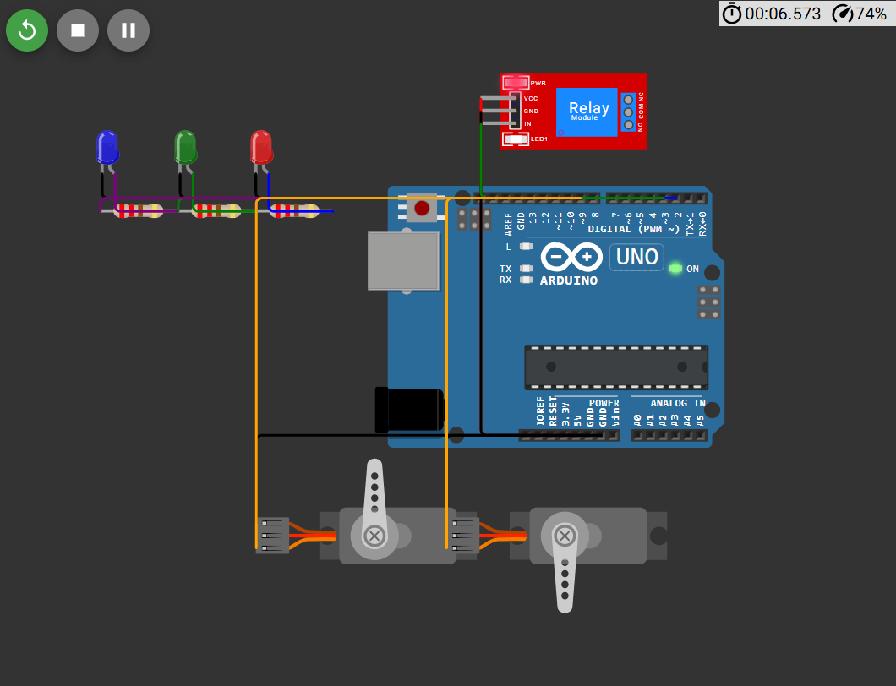
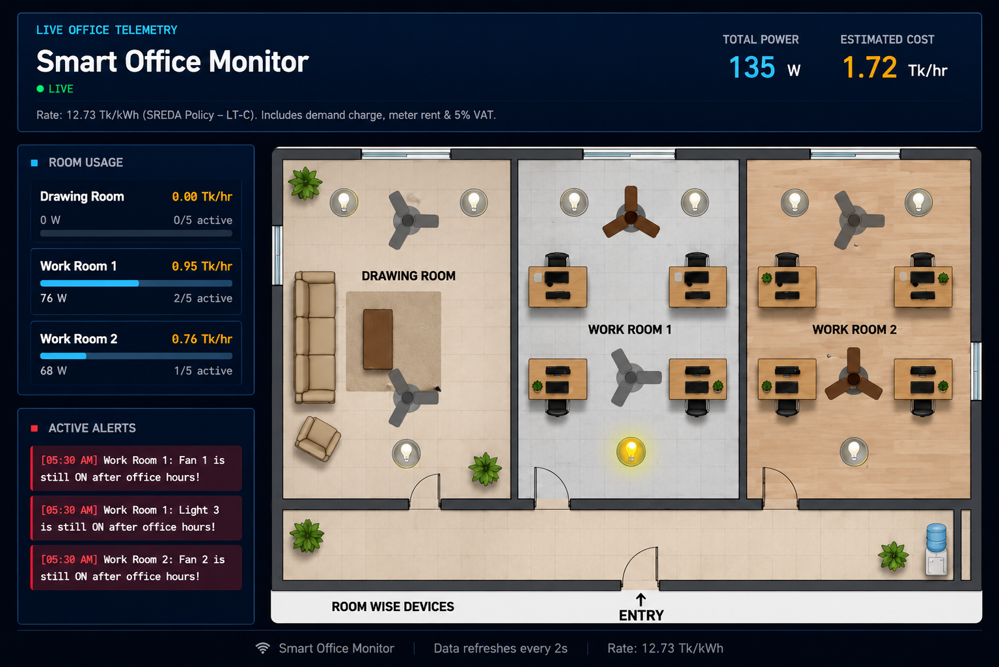
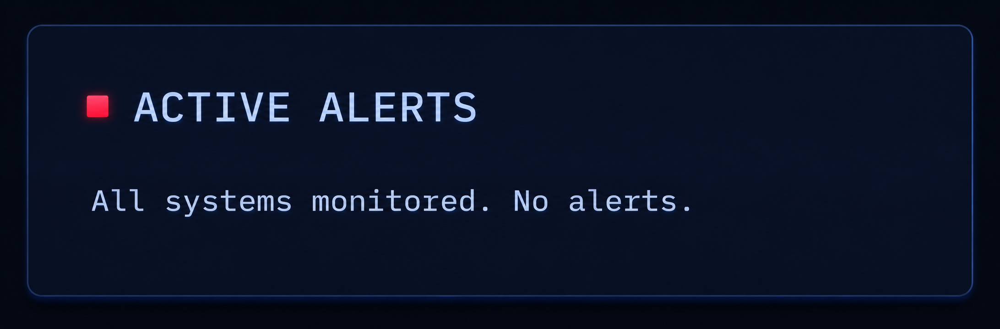
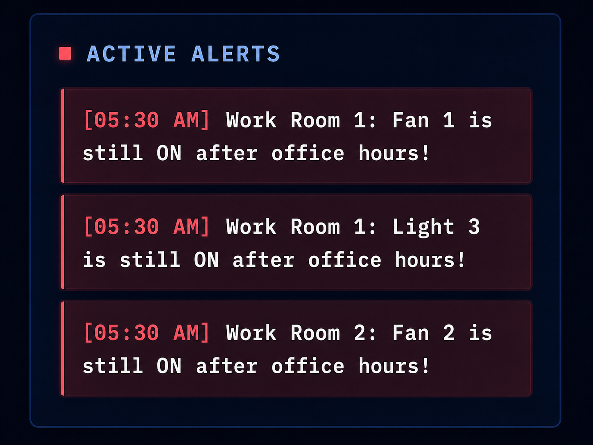
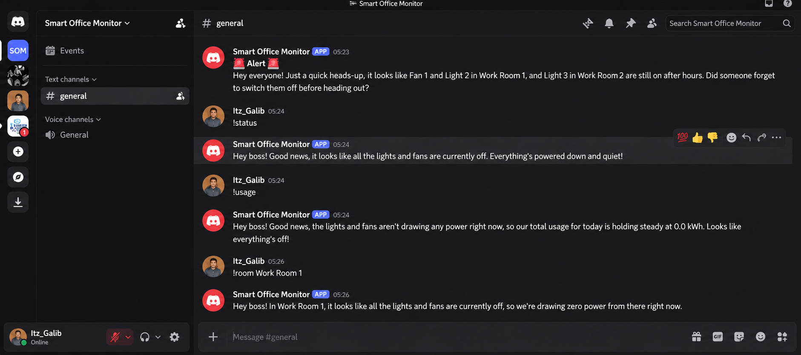

# Smart Office Monitor

A simple real-time system for monitoring and controlling office lights and fans.

This project helps users see which devices are ON or OFF, monitor current power usage, control devices from a dashboard, and receive smart alerts through a Discord AI bot.

## Live Deployment

**Experience the Smart Office Monitoring Dashboard by clicking the button below:**


<p align="center">
  <a href="https://bappybdn.github.io/Smart_Office_Monitor/">
    
  </a>
</p>


## Demo Video

**Experience the Smart Office Monitoring demo video by clicking the button below:**

<p align="center">
  <a href="https://youtu.be/G_YasilfTBQ">
    
  </a>
</p>
<p align="center">
  <a href="https://youtu.be/G_YasilfTBQ">
    
  </a>
</p>


## Full System Workflow


This image shows the complete process of the system, from IoT-ready data collection to dashboard monitoring and Discord AI response.

## Hardware Simulation with Wokwi

This project also includes a Wokwi-based hardware simulation to show how the smart building system can work with real IoT devices.

In this hardware simulation, we use an Arduino Uno to demonstrate a smart office with three rooms. The LEDs represent the ON/OFF status of the lights in each room, while the servo motors represent the fans. This is a demo simulation, but in the future it can be easily integrated with real IoT devices to control and monitor an actual smart building in real time.



### Components Used

- Arduino Uno
- 3 LEDs: Red, Green, Blue
- 3 Resistors: 220Ω
- Relay Module
- 2 Servo Motors
- Jumper Wires

### Pin Connection Summary

- Red LED connected to Arduino pin 2
- Relay module connected to Arduino pin 3
- Green LED connected to Arduino pin 4
- Blue LED connected to Arduino pin 5
- Servo Motor 1 connected to Arduino pin 9
- Servo Motor 2 connected to Arduino pin 10

The simulation uses the Servo library for controlling the servo motors.  


## Wokwi Hardware Simulation
**Experience the Wokwi Hardware Simulation by clicking the button below:**
<p align="center">
  <a href="https://wokwi.com/projects/468609762088143873">
    
  </a>
</p>


## What This Project Does

This project works like a smart office monitoring system.

It can:

- Monitor lights and fans in different rooms
- Show live ON/OFF status
- Show current total power usage
- Show room-wise power usage
- Allow users to turn devices ON or OFF from the dashboard
- Detect unnecessary electricity usage
- Send alerts when devices are left ON after office hours or running for a long time
- Reply to users through a Discord AI bot


## Main Idea

In many offices, lights and fans are often left ON after office hours. This wastes electricity and increases cost.

This system helps solve that problem by continuously checking device status and showing everything in one place.

Users can quickly understand:

- Which room is using power
- Which device is ON
- Which device should be turned OFF
- Whether any alert has been generated
- How much power is currently being used


## How the System Works

The system follows five main steps.

### Step 1: Data Collection

Device data comes from IoT hardware or a demo simulator.

In real life, this data can come from devices like ESP32 or Wokwi simulation.

For the demo version, a simulator creates realistic device activity.


### Step 2: Data Storage

All device information is stored in a simple data file.

The stored information includes:

- Device name
- Room name
- Device type
- Current status
- Power usage
- Last changed time

This works like the main memory of the system.


### Step 3: Backend Processing

The backend works as the brain of the system.

It receives requests, reads device information, updates device status, checks alert rules, and sends clean data to the dashboard and Discord bot.

The backend also makes sure data is handled safely when multiple parts of the system are working at the same time.


### Step 4: Web Dashboard

The dashboard shows the current building condition visually.

Users can see:

- Live connection status
- Total power usage
- Estimated power cost (Demo)
- Room-wise usage
- Device status
- Active alerts

Users can also click on a fan or light to turn it ON or OFF.


### Step 5: Discord AI Bot

The Discord bot helps users check the building status through simple commands.

The bot can answer questions like:

- What is the current status?
- Which devices are ON?
- What is the usage?
- What is happening in a specific room?

Gemini AI converts system data into short, natural, and easy-to-understand replies.


## Important Features

### 1. Live Monitoring

The system updates automatically after a short time, so the user does not need to refresh the page again and again.


### 2. Manual Control

Users can control lights and fans directly from the dashboard.

This makes the system more practical and interactive.


### 3. Power Usage Calculation

The system calculates how much power is being used based on the devices that are currently ON.

This helps users understand electricity consumption clearly.


### 4. Room-Wise Summary

The dashboard shows power usage room by room.

This helps users quickly identify which room is using more electricity.


### 5. Smart Alerts

The system creates alerts when something unusual happens.

For example:

- A device is still ON after office hours
- A device has been ON for a long time

This helps users identify unnecessary electricity usage.


### 6. AI-Based Discord Reply

The Discord bot does not only show raw data.

It gives short, friendly, and human-like replies so that anyone can understand the building status easily.


## Benefits of This Project

This project can help to:

- Identify unnecessary electricity usage
- Support energy-saving decisions
- Monitor office devices easily
- Detect forgotten lights and fans
- Make office management smarter
- Provide remote updates through Discord
- Help non-technical users understand device status
- Demonstrate an IoT-ready architecture using a web dashboard, backend, and AI


## Who Can Use This System

This system can be useful for:

- Offices
- Classrooms
- University labs
- Smart homes
- Small buildings
- Computer labs
- Research projects
- IoT-based automation demos


## Technologies Used

- Python 3
- FastAPI
- HTML
- CSS
- JavaScript
- Discord.py
- Google Gemini 2.5 Flash
- JSON data storage


## Main Parts of the Project

### 1. Data Layer

This part stores all device information.

It keeps track of:

- Fan status
- Light status
- Room information
- Power usage
- Last update time


### 2. Backend Layer

This part processes all requests.

It connects the data layer with the dashboard and Discord bot.


### 3. Dashboard Layer

This is the visual part of the project.

Users can monitor and control the system from here.


### 4. Discord Bot Layer

This part allows users to get updates from Discord.

It also sends alert messages when needed.


### 5. Gemini AI Layer

This part uses Gemini AI to convert system data into simple and natural language replies.


## Screenshots


### 1. Web Dashboard



Use this screenshot to show the main dashboard with device status, power usage, and room summary.


### 2. Device Status


Use this screenshot to show lights and fans in ON/OFF condition.


### 3. Alert Section

### Alert System Preview

The system shows warning messages or active alerts based on office time.

### Office Time: 9:00 AM – 5:00 PM

During office hours, no unnecessary alert will be shown because lights and fans may normally be in use.



### After Office Time

After office hours, if any light or fan remains ON, the system will show an active alert or warning message.



### 4. Discord Bot Reply



Use this screenshot to show bot commands and AI-generated replies.


## Recommended Demo Video Content

Your demo video should show:

1. Project overview
2. Dashboard opening
3. Live device status
4. Turning a fan or light ON/OFF
5. Power usage changing
6. Alert generation
7. Discord bot command
8. AI reply from the bot
9. Final explanation of benefits


## Project Workflow in Simple Words

First, the system collects device data.

Then, it stores the data safely.

After that, the backend processes the data.

The dashboard updates automatically and shows the latest device status.

If the user clicks a device, the system updates the status.

If any device creates a problem, the system generates an alert.

The Discord bot can also collect the same data and explain it in simple language using AI.


## Why This Project Is Useful

This project is useful because it connects automation, monitoring, and AI in one system.

It does not only show data. It helps users take action.

For example, if a light is left ON after office hours, the system can detect it and send an alert.

This can reduce electricity waste and make building management easier.

##  Project Setup

Follow the steps below to set up and run the Smart Office Monitoring System on your local machine.

### 1. Clone the Repository

```bash
git clone https://github.com/bappyBDN/Smart-Office-Monitor.git
cd Smart-Office-Monitor
```

### 2. Create a Virtual Environment (Recommended)

**Windows**

```bash
python -m venv venv
venv\Scripts\activate
```

**Linux / macOS**

```bash
python3 -m venv venv
source venv/bin/activate
```

### 3. Install Dependencies

Install the backend dependencies:

```bash

pip install -r requirements.txt
```

Install the Discord Bot dependencies:

```bash

pip install -r requirements.txt
```

### 4. Configure Environment Variables

Create a `.env` file inside the `discord_bot` folder and add the following configuration:

```env
DISCORD_TOKEN=YOUR_DISCORD_BOT_TOKEN
GEMINI_API_KEY=YOUR_GEMINI_API_KEY
ALERT_CHANNEL_ID=YOUR_DISCORD_CHANNEL_ID
BASE_URL=http://127.0.0.1:8000
```

### 5. Start the Backend Server

Navigate to the backend directory and run:

```bash

uvicorn main:app --reload
```

The backend API will be available at:

- **API:** `http://127.0.0.1:8000`
- **Swagger Docs:** `http://127.0.0.1:8000/docs`

### 6. Launch the Dashboard

Open the `dashboard` folder and run:

```text
index.html
```

Or use **VS Code Live Server** for automatic reloading during development.

### 7. Run the Discord Bot

Open a new terminal and execute:

```bash

python bot.py
```

If the setup is successful, you should see:

```text
Logged in as Smart Office Bot
```

The bot is now connected to your Discord server and ready to receive commands.

### 8. Verify the Setup

To ensure the project is running correctly:

-  Backend API is accessible.
-  Dashboard loads successfully in the browser.
-  Device status updates in real time.
-  Discord Bot responds to commands.
-  AI-generated responses are returned using Gemini.
-  Smart alerts are generated after office hours.
-  Wokwi hardware simulation operates correctly.

## Deployment

The project is deployed online. The **FastAPI backend** and **Discord Bot** run on Render, while the **frontend dashboard** is hosted on GitHub Pages.

### Live Links

- **Frontend Dashboard:** [https://bappybdn.github.io/Smart_Office_Monitor/]
- **Backend API:** [https://smart-office-monitor-d41y.onrender.com]


### Backend & Bot Deployment

The backend and Discord Bot are deployed together on **Render** using a custom `start.sh` script.

```bash
Build Command: pip install -r requirements.txt
Start Command: bash start.sh
```

Required environment variables:

```env
DISCORD_TOKEN=YOUR_DISCORD_BOT_TOKEN
GEMINI_API_KEY=YOUR_GEMINI_API_KEY
ALERT_CHANNEL_ID=YOUR_DISCORD_CHANNEL_ID
```

The `start.sh` script runs the Discord Bot in the background and starts the FastAPI server.

---

### Frontend Deployment

The frontend is deployed using **GitHub Pages**.

```text
Repository Settings → Pages → Deploy from a branch → main branch → Save
```

After deployment, update the API links in `script.js`:

```javascript
const API_URL = "https://smart-office-monitor-d41y.onrender.com";
const ALERTS_URL = "https://smart-office-monitor-d41y.onrender.com/alerts";
```
## Future Improvements

In the future, this system can be improved by adding:

- Real ESP32 hardware connection
- Mobile app
- User login system
- Voice command
- Email alert
- SMS alert
- More rooms and devices
- Replace JSON storage with a cloud database


## Conclusion

The Smart Building Management System is a complete real-time monitoring and control system.

It helps users manage lights and fans, reduce energy waste, and understand building status easily.

The project combines IoT-ready data flow, backend processing, web dashboard, Discord bot, and AI response in one practical system.


## Author

Bappy Chandra Debnath
bappy.cse.20210204074@aust.edu

Md. Luthful Hasan Galib
luthful.cse.20210204081@aust.edu

Mobarak Hossan Refat
mobarak.cse.20210204085@aust.edu

Partha Sarker
partha.cse.20210204072@aust.edu


## Developed by: Team_Zero

## THANK YOU 
